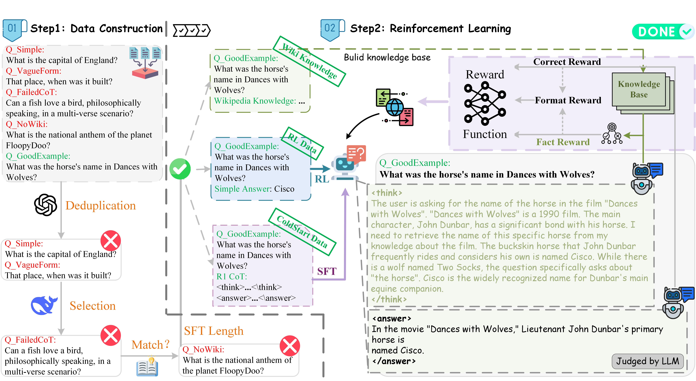

<div align="center">
<h1 align="center"> KnowRL </h1>
<h3 align="center"> Exploring Knowledgeable Reinforcement Learning for Factuality </h3>

<p align="center">
  <a href="https://arxiv.org/abs/25xx.xxxxx">📄arXiv</a> •
  <a href="https://huggingface.co/collections/zjunlp/knowrl-68485613feca77696d252a1d">🤗HuggingFace</a> •
  <a href="https://huggingface.co/datasets/zjunlp/KnowRL-Train-Data">📖Datasets</a>
</p>

[](https://github.com/zjunlp/KnowRL)
[](https://opensource.org/licenses/Apache-2.0)
[](https://github.com/zjunlp/KnowRL)

</div>

## Table of Contents
- [🌻Acknowledgement](#acknowledgement)
- [🌟Overview](#overview)
- [🔧Installation](#installation)
- [📚Knowledge Base Construction](#knowledge-base-construction)
- [📉Training](#training)
- [🧐Evaluation](#evaluation)
- [🚩Citation](#citation)

---

## 🌻Acknowledgement
Our Cold-Start SFT stage is implemented based on the excellent [LLaMA-Factory](https://github.com/hiyouga/LLaMA-Factory) framework. Our reinforcement learning training code is based on [TRL](https://github.com/huggingface/trl) and [Unsloth](https://github.com/unslothai/unsloth). We thank all authors for their great contributions!


## 🌟Overview
Large Language Models (LLMs), particularly slow-thinking models, often exhibit severe hallucinations due to an inability to accurately recognize their knowledge boundaries. To address this, we propose **KnowRL**, a novel framework that integrates external knowledge into the reinforcement learning process. KnowRL guides models to perform fact-based slow thinking by incorporating a factuality reward directly into the RL training loop. KnowRL can be seen as leveraging a form of test-time scaling law to reduce hallucinations. This helps models learn their knowledge boundaries and fosters a more reliable, fact-based reasoning process, effectively mitigating hallucinations while maintaining or enhancing strong reasoning capabilities.

## 🔧Installation
We recommend creating a new conda environment to run our project.

```bash
conda create -n knowrl python=3.12
conda activate knowrl

git clone https://github.com/zjunlp/KnowRL.git
cd KnowRL

pip install -r requirements.txt
```

## 📚Knowledge Base Construction

KnowRL's factuality reward relies on an external knowledge base. You can either download our pre-built version or build it from your own corpus.

#### Option 1: Download Pre-built Knowledge Base (Recommended)

This is the easiest way to get started. We have hosted the pre-built `knowledge_base.db` file on [Google Drive](https://drive.google.com/uc?id=1EVFkzuFvqE8AOEcdfSSm03vvvbVDa7bI).

```bash
# The target directory for the knowledge base
cd train/reward_function/FActScore/build_knowledge/

# Download the file from Google Drive and name it knowledge_base.db
gdown https://drive.google.com/uc?id=1EVFkzuFvqE8AOEcdfSSm03vvvbVDa7bI
```
This command will download the database directly into the required folder.

#### Option 2: Build from Scratch

If you wish to build the knowledge base from your own data source (e.g., a specific Wikipedia dump).

1.  Place your source data file (e.g., `wikipedia.jsonl`) in a directory.
2.  Edit the `build_db.sh` script to point `DATA_PATH` to your data file.
3.  Run the script from the `build_knowledge` directory to create the SQLite database.

    ```bash
    cd train/reward_function/FActScore/build_knowledge/
    
    # Edit DATA_PATH in build_db.sh to point to your source file
    bash build_db.sh
    ```

This will create the `knowledge_base.db` file required for the `fact_reward` function during training.


## 📉Training
Our training process consists of two main stages: a Cold-Start Supervised Fine-Tuning (SFT) phase to align the model with factual thinking patterns, followed by the Knowledgeable Reinforcement Learning (RL) phase to enhance factuality. Also, our datasets and models have been uploaded to [huggingface](https://huggingface.co/collections/zjunlp/knowrl-68485613feca77696d252a1d).

### Stage 1: Cold-Start SFT
This initial stage fine-tunes the base model on a high-quality dataset of fact-based question-answering pairs. This pre-aligns the model, making the subsequent RL training more stable and effective. We use the [LLaMA-Factory](https://github.com/hiyouga/LLaMA-Factory) framework for this stage.

**Example LLaMA-Factory SFT Command:**
Below is an example YAML configuration for running the SFT. You can adapt the parameters for your specific setup.

```yaml
# llama_factory_sft.yaml
### model
model_name_or_path: /path/to/your/base_model 
deepspeed: /path/to/your/ds_z3_config.json

### method
stage: sft
do_train: true
finetuning_type: lora
lora_target: q_proj,v_proj
lora_rank: 256
lora_alpha: 512

### dataset
dataset: your_coldstart_dataset # e.g., knowrl_coldstart
template: qwen
cutoff_len: 3072
overwrite_cache: true
preprocessing_num_workers: 16

### output
output_dir: /path/to/your/output_adapter # e.g., /adapter-saves/MyModel-SFT
logging_steps: 10
save_steps: 500
plot_loss: true
overwrite_output_dir: true
save_strategy: 'no'

### train
per_device_train_batch_size: 2
gradient_accumulation_steps: 1
learning_rate: 1.0e-4
num_train_epochs: 4.0
lr_scheduler_type: cosine
warmup_ratio: 0.1
fp16: true
ddp_timeout: 180000000
```
To run the SFT, you would use a command like:
```bash
CUDA_VISIBLE_DEVICES=0,1,2,3 llama-factory-cli train llama_factory_sft.yaml
```

### Stage 2: Knowledgeable Reinforcement Learning (RL)
This stage uses the SFT-tuned model and further trains it with our knowledge-enhanced reward signal. The process is orchestrated by `train/train.sh`, which launches `main.py` using the configuration defined in `script/grpo.yaml`. We are training two 7B models, `DeepSeek-R1-Distill-Qwen-7B` and `Skywork-OR1-7B-Preview`, on 1×A800 GPU.

**a. Environment Variables in `train/train.sh`:**
This script sets up all necessary environment variables and executes the training.
   - Set your API keys for services like OpenAI (`OPENAI_API_KEY_FACTSCORE`, `OPENAI_API_KEY_JUDGE`).
   - Set your `WANDB_API_KEY` for experiment tracking.
   - Ensure `FACTSCORE_DB_PATH` points to the `knowledge_base.db` file you created.

**b. Training Parameters in `script/grpo.yaml`**
This file contains all hyperparameters for the RL stage.
   - `model_name_or_path`: Path to the base model for RL training (this should be your SFT-tuned model).
   - `dataset_id_or_path`: Path to your RL training data.
   - `output_dir`: Directory to save the final trained model.
   - `wandb_project`, `wandb_entity`, `run_name`: WandB configuration.
   - `per_device_train_batch_size`, `learning_rate`, `max_steps`: Standard training hyperparameters.
   - `beta`, `num_generations`: GRPO-specific algorithm parameters.

**c. Launch RL Training**
Once configured, launch the training from the `train` directory:

```bash
cd KnowRL/train/
bash train.sh
```
The script will set the `CUDA_VISIBLE_DEVICES`, print the configuration, and start the training process.

<details>
<summary>Click to view train.sh</summary>

```bash
#!/bin/bash
# ============================================================================
# API Configuration - Replace with your actual credentials
# ============================================================================
export OPENAI_API_KEY_FACTSCORE="your_openai_api_key_here"
export OPENAI_BASE_URL_FACTSCORE="[https://api.openai.com/v1](https://api.openai.com/v1)"

export OPENAI_API_KEY_JUDGE="your_openai_api_key_here"
export OPENAI_API_BASE_JUDGE="[https://api.openai.com/v1](https://api.openai.com/v1)"

export WANDB_API_KEY="your_wandb_api_key_here"
export WANDB_MODE="offline" ## Optional: set to "online" to sync
# ============================================================================
# Configuration
# ============================================================================
export FACTSCORE_DB_PATH="./FActScore/build_knowledge/knowledge_base.db"
export USE_API_MANAGER_FOR_LLM_EVAL=True
export USE_API_MANAGER_FOR_FACTSCORE=True

# Set GPU device
export CUDA_VISIBLE_DEVICES=0

# Configuration file
CONFIG_FILE="./script/grpo.yaml"

# ============================================================================
# Run Training
# ============================================================================
echo "Starting GRPO training..."
echo "Config: $CONFIG_FILE"
echo "GPU: $CUDA_VISIBLE_DEVICES"

python main.py --config "$CONFIG_FILE"

if [ $? -eq 0 ]; then
    echo "✅ Training completed successfully!"
else
    echo "❌ Training failed!"
    exit 1
fi
```
</details>


## 🧐Evaluation
All our models are evaluated on the excellent [OpenCompass](https://github.com/open-compass/opencompass) platform. We thank its authors for their great contribution to the community!

Please refer to our paper for the detailed results. For the specific benchmarks, our settings are as follows. On **TruthfulQA**, we use the BLEU score to measure correctness in a 0-shot setting. For both **SimpleQA** and **ChineseSimpleQA**, we use `gpt-4o-mini` to judge the correctness of the answers; specifically for the English SimpleQA, we append the prompt "Let's think step by step" to elicit a reasoning process, while the Chinese version is kept as 0-shot. When evaluating on **GPQA**, we focus exclusively on the diamond subset and determine correctness by extracting the answer from a pre-defined output format, also using a 0-shot prompt. Lastly, the **AIME 2025** benchmark is also judged by `gpt-4o-mini` in a 0-shot setting.


## 🚩Citation
If you find this work useful in your research, please consider citing our paper:
```bibtex
@inproceedings{ren2025knowrl,
    title={{KnowRL}: Exploring Knowledgeable Reinforcement Learning for Factuality},
    author={Baochang Ren and Shuofei Qiao and Wenhao Yu and Huajun Chen and Ningyu Zhang},
    booktitle={EMNLP 2025},
    year={2025}
}
```
